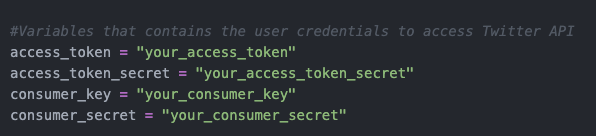
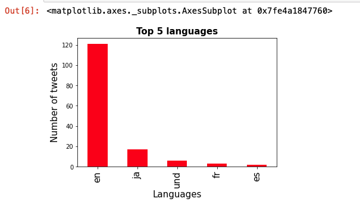

# tweepy

Download latest tweets from the feed by running "python3 first.py > twitter_data.txt"
This creates a text file named twitter_data and downloads the tweets until you press "ctrl+c".



Get the above credentials from https://developer.twitter.com/en/portal


### Analyze the trends in the data  downloaded from the script and find the trending words in recent tweets using this:

```
tweets['pubg'] = tweets['text'].apply(lambda tweet:word_in_text('pubg', tweet))
tweets['cycling'] = tweets['text'].apply(lambda tweet: word_in_text('cycling', tweet))
tweets['recipe'] = tweets['text'].apply(lambda tweet: word_in_text('recipe', tweet))

print (tweets['recipe'].value_counts()[True])
```

## Results

